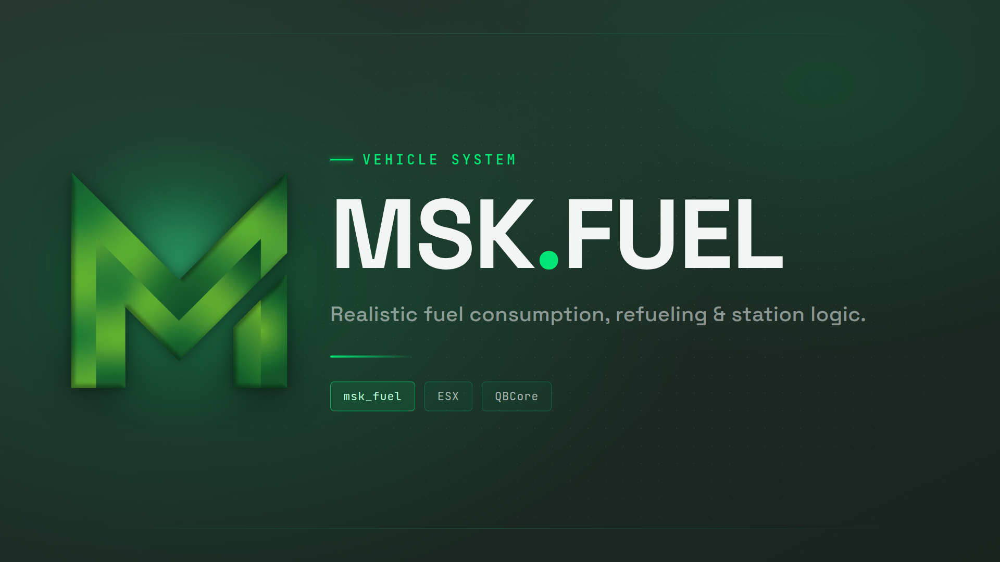

This script uses the new [Fuel consumption](https://docs.fivem.net/docs/scripting-manual/using-new-game-features/fuel-consumption/) game feature. The complete fuel state (level, max volume, fuel type) is stored on **StateBags** and is therefore fully network-synchronized between all players.

Since **v1.2.0** it is more than a fueling system: fuel stations are businesses that players can buy, staff, price and supply.

[Documentation](https://docu.msk-scripts.de/docs/msk_fuel/)

## Features

### ⛽ Fuel Types

Four different fuel types, configurable per vehicle model:

- **Gas** (`gas`) – default for most cars
- **Diesel** (`diesel`) – trucks, vans, etc.
- **Kerosin** (`kerosin`) – for airplanes and helicopters
- **Electric** (`electric`) – for electric vehicles

Every vehicle model is mapped to its fuel type in `config.vehicles.lua`. The fuel type is calculated automatically and cached on the vehicle's state.

### 🔫 Realistic Refueling

- Grab the **nozzle** from a fuel pump – it is attached to the player with a physical rope.
- Walk over to the vehicle and attach the nozzle to its fuel cap (the bone is detected automatically – `petrolcap`, `petroltank`, etc., with special handling for bikes, helis and planes).
- Take the nozzle back and return it to the pump when you are done.
- A distance watchdog automatically cancels the refueling if the player, the vehicle or the pump get too far apart (larger ranges for helicopters and planes).

### 🛢️ Petrolcan (Jerry Can)

- **Buy** a petrolcan at any fuel station.
- **Refill** an empty petrolcan at the station.
- **Refuel vehicles** anywhere with the petrolcan – durability/ammo of the can is consumed while fueling.

### 💥 Wrong Fuel & Engine Damage

- Optionally allow players to fill up with the **wrong fuel type**.
- If more than a configurable amount (default **15 L**) of the wrong fuel is added, the engine starts to **fail progressively** (stuttering, stalling, engine health drops).
- Electric vehicles cannot be refueled with liquid fuel and vice-versa.
- Damaged engines can be repaired with the `/repairVehicle` command.
- Optional integration with **msk_enginetoggle** (engine is flagged as damaged).

### 📈 Fuel Consumption

- Fuel is only consumed while the **engine is running**.
- Global consumption rate is configurable (`Config.FuelConsumptionRateMultiplier`).
- A **damaged fuel tank** (`petrol tank health < 700`) causes additional fuel loss / leaking.
- Per-model tank volume override via `config.tankvolume.lua`.

### 🏪 Fuel Business

Fuel stations can be bought and run as a business:

- **Buy and sell** a station at its pump.
- **Stock per fuel type** – an empty tank blocks that fuel type until it is restocked.
- **Prices per station**, dynamic or fixed, on top of a server-wide base price that drifts with total demand across the map.
- **Staff** with ranks, salaries, delivery bonuses and seven per-station permissions.
- **Supply** through an NPC driver (instant, surcharge) or a delivery run you drive yourself (cheaper, three rigs, crash damage spills cargo).
- **Public delivery jobs** at unowned stations, paid per delivered liter.
- **Pump wear** – worn pumps fuel slower, broken ones stop working until repaired.
- Two in-game dashboards (React + Vite + Tailwind), one for admins and one for owners.

See the [documentation](https://docu.msk-scripts.de/docs/msk_fuel/business) for the whole picture.

### 📍 Fuel Stations

- Default **map fuel pumps** (props) are usable out of the box via `ox_target`.
- **Custom fuel stations** can be spawned at any coordinates (`Config.CustomFuelStations`).
- **Vehicles & trailers as mobile fuel stations** – e.g. tankers (`tanker`, `armytanker`), the utility truck, generators for electricity, kerosin tanks for airfields.
- **Blips** for all fuel station locations (configurable, can be disabled).

### 🛠️ Admin Commands

| Command             | Description                                                        |
| ------------------- | ------------------------------------------------------------------ |
| `/setFuel [amount]` | Set the fuel level of the vehicle you are sitting in (default 100) |
| `/repairVehicle`    | Repair a vehicle that was damaged by wrong fuel                    |
| `/fueladmin`        | Open the admin dashboard (name configurable, own permission system) |

Commands are restricted to the groups defined in `Config.Commands.allowedGroups` (default: `superadmin`, `admin`).

### 🌐 Other

- **Multi-language** support (German & English included, easily extendable in `translation.lua`).
- **ox_inventory** money integration for all purchases.
- Built-in **version checker**.
- Lua 5.4.

## Exports

The script exposes a number of useful exports (client & server) for other resources, e.g.:

```lua
-- Client
exports.msk_fuel:GetVehicleFuel(vehicle)
exports.msk_fuel:SetVehicleFuel(vehicle, fuel)
exports.msk_fuel:GetVehicleMaxFuel(vehicle)
exports.msk_fuel:SetVehicleMaxFuel(vehicle, maxFuel)
exports.msk_fuel:GetVehicleFuelType(vehicle)
exports.msk_fuel:SetVehicleFuelType(vehicle, fuelType)
exports.msk_fuel:SetEngineFailure(vehicle)
exports.msk_fuel:SetEngineRepaired(vehicle)

-- Server
exports.msk_fuel:GetVehicleFuel(netId)
exports.msk_fuel:SetVehicleFuel(netId, fuel)
```

## Configuration

All settings are located in:

- `config.lua` – main configuration (fuel types, pump models, blips, commands)
- `config.stations.lua` – station seed: zones, fuel types sold, purchase prices, fuel depots
- `config.business.lua` – economy seed: prices, market, supply, payroll, maintenance
- `config.vehicles.lua` – vehicle model → fuel type mapping
- `config.tankvolume.lua` – per-model tank volume overrides
- `translation.lua` – language strings

`config.stations.lua` and `config.business.lua` are **seeds**: they are imported into the database on the first start, and from then on the database is the source of truth. Edit them in the admin dashboard.

### NUI

The dashboards are built from `web/` into `html/`, and `html/` is committed. The server needs no npm. After changing the UI:

```bash
cd web
npm install
npm run build
```

## Requirements

- [msk_core](https://docu.msk-scripts.de/)
- [ox_target](https://github.com/overextended/ox_target)
- [ox_inventory](https://github.com/overextended/ox_inventory)
- [oxmysql](https://github.com/overextended/oxmysql) – since v1.2.0

Add this single line to your `server.cfg` so the dashboard's group permissions work (it covers every MSK script at once):

```cfg
add_ace resource.msk_core command.add_ace allow
```

## Optional

- [msk_enginetoggle](https://docu.msk-scripts.de/) – for engine on/off & damage integration
